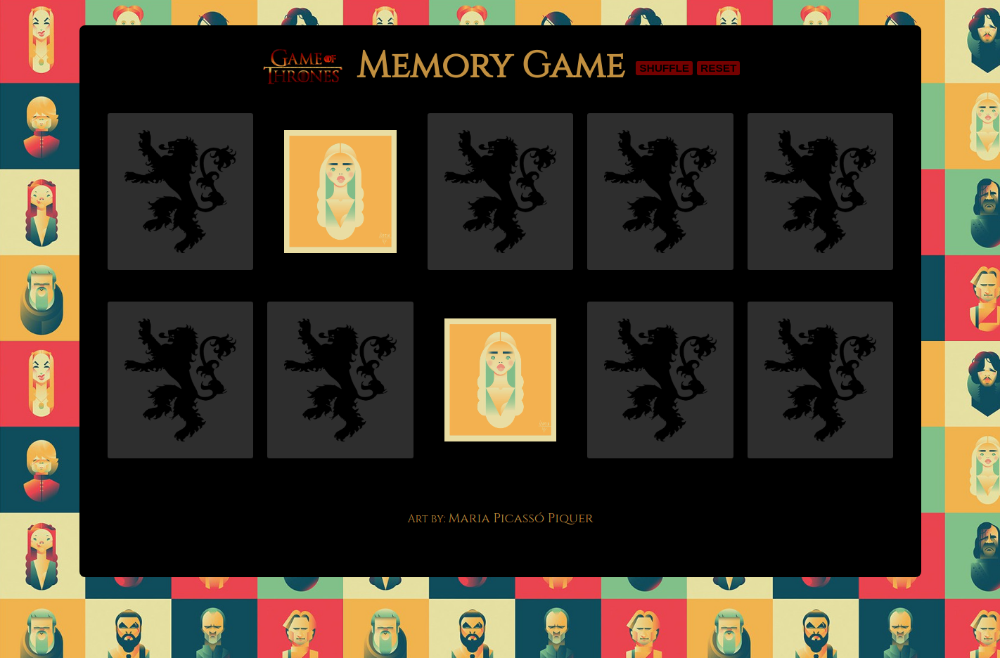

#Matching Card Game

### Goal: Make a 10 card memory game - users must be able to select two cards and check if they are a match. If they are a match, they stay flipped. If not, they flip back over. Game is done when all cards are matched and flipped over.

**LINK TO PROJECT** https://optimistic-franklin-a670a4.netlify.com

## How It's Made:

**Tech used:** HTML5, CSS3, JavaScript.

## Lessons Learned:
Used setTimout() to delay my function from running so that the player could see what is underneath the second card they clicked, so that the user gets a chance to flip and see the second card without the function checking for a match & flipping the card over to fast. Also learned how to shuffle the element in my section container holding the different cards without changing my hard coded html by using the css property order.

## Examples:

**Weather API** https://github.com/ericamendez/weather-api-bootcamp2018c-week07

**Simple NASA API** https://github.com/ericamendez/simple-nasa-api-bootcamp2018c-week07

**Daily Code Challenges:** https://github.com/Eriquette/Daily-Code-Challenges
